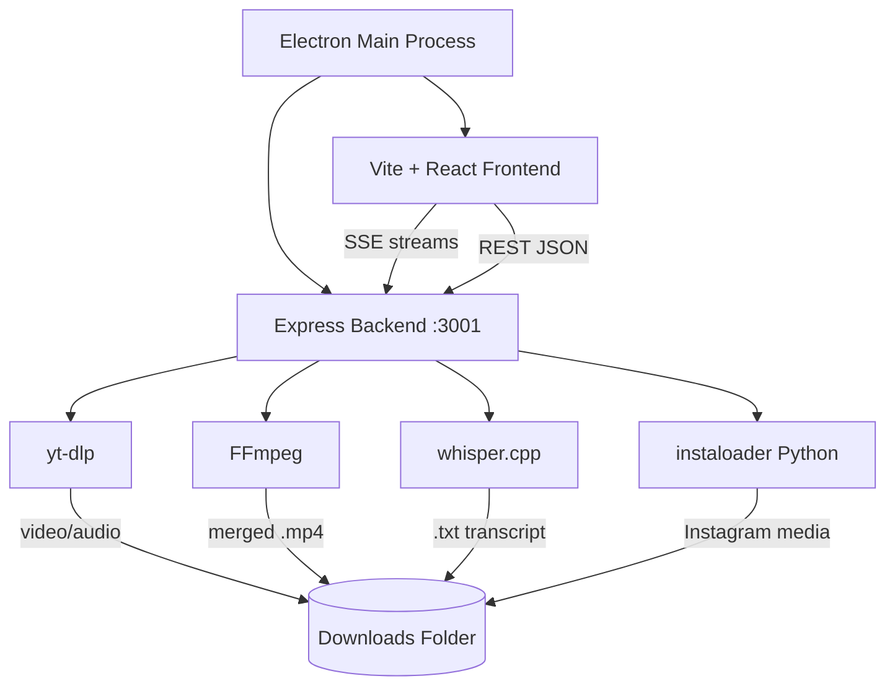
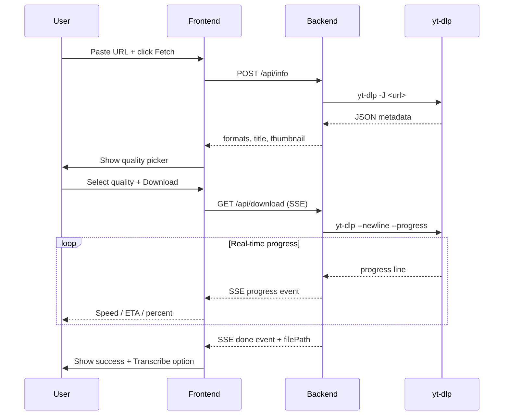

<p align="center">
  
</p>

<h1 align="center">KineTube</h1>

<p align="center">
  A privacy-first desktop downloader for YouTube and Instagram.<br/>
  No accounts. No cloud. No data leaves your machine.
</p>

<p align="center">
  <a href="https://github.com/spacesdrive/kinetube/releases"></a>
  <a href="https://github.com/spacesdrive/kinetube/blob/main/LICENSE"></a>
  <a href="https://github.com/spacesdrive/kinetube/commits/main"></a>
  
  
</p>

---

## What is KineTube

KineTube is a cross-platform desktop application that lets you download videos from YouTube and Instagram, transcribe them locally using Whisper AI, and manage your media -- entirely offline. It is built on Electron, React, and Express, and delegates all heavy lifting to battle-tested open-source tools (yt-dlp, FFmpeg, whisper.cpp, instaloader) that it downloads and manages automatically on first launch.

There is no server to sign up for, no API key to buy, and no usage limit. Everything runs on your computer.

---

## Features

| Category | Capability |
|---|---|
| **YouTube** | Videos, Shorts, channels, playlists -- up to 4K with FFmpeg merging |
| **Instagram** | Reels, posts, stories, full profile bulk-download (up to 500 posts) |
| **Audio extraction** | Rip MP3 from any video with one click |
| **Transcription** | Local Whisper AI transcription in 13 languages, five model sizes |
| **Batch downloads** | Mix YouTube and Instagram URLs in one queue |
| **Dark mode** | System-aware theme with manual override |
| **Private content** | Instagram login with 2FA support and multi-account management |
| **Filename control** | Prefix, suffix, numbering, and custom yt-dlp templates |
| **Progress streaming** | Real-time speed, ETA, and phase indicators via SSE |

---

## Architecture





---

## Quick Start

### Prerequisites

- [Node.js](https://nodejs.org/) 18 or later
- [Python](https://www.python.org/) 3.8 or later (required for Instagram login only)

All other dependencies (yt-dlp, FFmpeg, whisper.cpp, instaloader) are downloaded automatically on first launch.

### Run in development

```bash
git clone https://github.com/spacesdrive/kinetube.git
cd kinetube
npm install
cd frontend && npm install && cd ..
npm run dev
```

This starts the Express backend, the Vite dev server, and Electron simultaneously via `concurrently`.

### Build a distributable

```bash
# Build the React frontend first
npm run build:frontend

# Then package for your platform
npm run dist:win    # Windows NSIS installer
npm run dist:mac    # macOS DMG
npm run dist:linux  # Linux AppImage
```

---

## How It Works

### YouTube downloads

KineTube calls yt-dlp under the hood. When you paste a URL and click Fetch, the backend runs `yt-dlp -J` to pull metadata and return available format streams to the frontend. On download, it constructs a format selector string such as `bestvideo[height<=1080][ext=mp4]+bestaudio[ext=m4a]` and streams progress back line-by-line over SSE. If FFmpeg is available, video and audio tracks are merged automatically.

### Instagram

Public content uses yt-dlp directly. Profile pages and private content route through `instaloader`, a Python library that handles Instagram's session-based authentication and pagination. KineTube wraps this in two helper scripts (`instaloader_login.py`, `instaloader_profile.py`) that communicate with the Express backend over stdin/stdout. Sessions are stored locally under `backend/sessions/` as binary cookie files.

### Transcription

After a download completes, or for any existing audio/video file, KineTube extracts a 16 kHz mono WAV via FFmpeg and passes it to `whisper-cli.exe` (whisper.cpp). The transcript is saved as a `.txt` file next to the source media. Five model sizes are available from Tiny (75 MB) to Large (2.9 GB) and are downloaded on demand from Hugging Face.

---

## Tech Stack

| Layer | Technology |
|---|---|
| Desktop shell | Electron 33 |
| Frontend | React 19, Vite 8, Tailwind CSS 4, shadcn/ui |
| Backend | Express 5, Node.js |
| Downloader | yt-dlp (auto-managed) |
| Merger | FFmpeg (auto-managed) |
| Transcription | whisper.cpp v1.8.4 BLAS x64 (auto-managed) |
| Instagram scraping | instaloader v4.15.1 (auto-managed) |
| Theme | next-themes |
| Icons | Lucide React |

---

## Project Structure

```
kinetube/
  electron/           # Electron main process and preload
  backend/
    routes/           # Express route handlers (download, info, instagram, transcribe, setup)
    utils/            # yt-dlp manager, binary helpers
    sessions/         # Instagram session files (gitignored)
    downloads/        # Default download output (gitignored)
    models/           # Whisper model files (gitignored)
  frontend/
    src/
      components/     # React components (shadcn-based UI)
      components/ui/  # shadcn/ui primitives
```

---

## Configuration

All settings persist in `localStorage` and survive app restarts.

| Setting | Description |
|---|---|
| Output folder | Custom path or default to `backend/downloads/` |
| Filename template | yt-dlp variables: `%(title)s`, `%(uploader)s`, `%(upload_date)s`, `%(id)s` |
| Numbering | Prepend a zero-padded sequence number to filenames |
| Prefix / suffix | Arbitrary text prepended or appended to every filename |
| Default Whisper model | Tiny / Base / Small / Medium / Large |
| Transcription language | Auto-detect or any of 13 preset languages |

---

## Instagram Setup

Instagram support requires Python to be installed and accessible on your PATH.

```bash
pip install instaloader
```

Once Python is detected, you can log in directly from the sidebar inside the app. Two-factor authentication is fully supported. Multiple accounts can be added and switched between without re-authenticating.

If you prefer to authenticate outside the app, copy the instaloader session file into `backend/sessions/session-<username>` and use the session import option in Settings.

---

## Keyboard Shortcuts

| Action | Shortcut |
|---|---|
| Toggle DevTools | F12 |
| New search | Click logo or "New search" button |
| Submit URL | Enter |

---

## Contributing

Contributions are welcome. To get started:

1. Fork the repository and create a branch from `main`.
2. Follow the Quick Start instructions above to run the project locally.
3. Make your changes. Keep commits focused and the diff readable.
4. Open a pull request with a clear description of what changed and why.

For larger changes, open an issue first to discuss the approach before investing time in the implementation.

---

## License

[MIT](LICENSE) -- use it, modify it, ship it.
