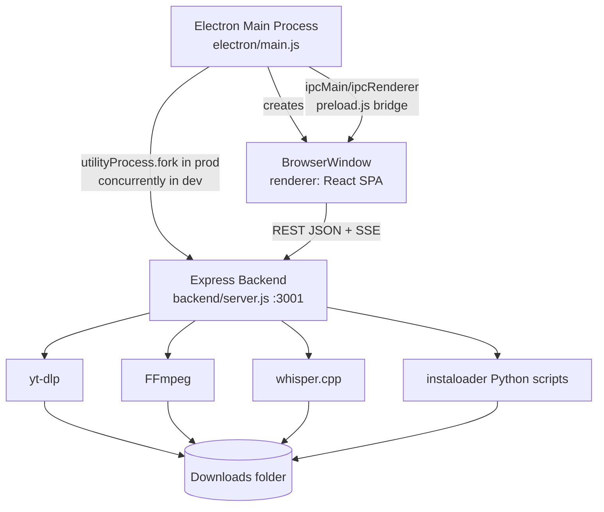

# Architecture Overview

## Process Topology

KineTube is three cooperating processes wrapped in one Electron app:



- **Main process** (`electron/main.js`) owns the window, the auto-updater, the native folder-picker dialog, and (in packaged builds) the Express child process.
- **Renderer** is the Vite-built React SPA. It talks to the backend over `http://localhost:3001` using plain `fetch`/`axios` for request/response calls and `EventSource`/manual SSE parsing for streaming operations.
- **Backend** is a single Express app that owns all filesystem and subprocess work: talking to yt-dlp, FFmpeg, whisper.cpp, and the instaloader Python scripts, and serving the built frontend in production.

## Dev vs. Packaged Startup

| | Development | Packaged |
|---|---|---|
| Backend start | `concurrently` runs `node --watch backend/server.js` alongside `vite` | `electron/main.js` calls `utilityProcess.fork(getServerPath())` after `app.whenReady()` |
| Frontend serving | Vite dev server on `:5173`, loaded via `mainWindow.loadURL('http://localhost:5173')` | Express serves `frontend/dist` as static files; `mainWindow.loadURL('http://localhost:3001')` after `waitForServer()` resolves |
| Writable data root | `backend/` itself (see `backend/utils/paths.js`) | `app.getPath('userData')`, injected as `ELECTRON_USER_DATA` env var |
| Backend readiness signal | Assumed up once `concurrently`'s `wait-on` sees `:3001` and `:5173` | Main process polls `GET /health` (`waitForServer()`) before navigating the window there |

This split exists because a packaged app cannot write into its own installation directory (particularly on Windows under Program Files) - see `docs/architecture/backend/EXPRESS.md` and ADR entries in `DECISIONS.md` about the userData redirect.

## Request Lifecycle - Metadata Fetch

```
Renderer
  -> POST /api/info { url }
      -> backend/routes/info.js
          -> parseYouTubeUrl() / parseInstagramUrl() (backend/utils/*UrlParser.js)
          -> spawn yt-dlp -J <url>  (via ytdlpManager.getYtdlpPath())
          -> parse yt-dlp's JSON stdout into formats/title/thumbnail
      <- JSON response
  <- Renderer shows quality picker
```

## Request Lifecycle - Streaming Download (SSE)

```
Renderer opens an EventSource/fetch-stream to GET /api/download?...
  -> backend/routes/download.js
      -> builds a yt-dlp format selector from the requested quality
      -> spawns yt-dlp --newline --progress
      -> for each stdout line: parse percent/speed/eta, emit SSE "progress" event
      -> on process exit 0: emit SSE "done" event with the final file path
      -> on process exit != 0 or spawn error: emit SSE "error" event
  <- Renderer updates ProgressModal.jsx in real time, shows success/failure
```

Transcription (`backend/routes/transcribe.js` + `backend/utils/whisperManager.js`) and first-run tool setup (`backend/routes/setup.js` + the `*Manager.js` `setupToolsWithProgress`/`ensureX` functions) follow the identical `phase` / `progress` / `done` / `error` SSE event shape. Any new long-running operation should reuse this shape rather than inventing a new one - see `docs/guidelines/ERROR_HANDLING.md`.

## Data Storage Strategy

| Data type | Where stored | Why |
|---|---|---|
| Managed binaries (yt-dlp, ffmpeg, whisper-cli, instaloader) | `{dataRoot}/downloads/*.exe` (+ DLLs) | Re-downloaded on demand; excluded from the packaged app bundle by `extraResources.filter` in `package.json` |
| Whisper GGML models | `{dataRoot}/models/*.bin` | Large (75 MB - 2.9 GB); downloaded from Hugging Face only when a model is selected |
| Instagram session cookies | `{dataRoot}/sessions/session-<username>` + `accounts.json` | Written by `instaloaderManager.js`; never returned in any API response |
| Downloaded media | User-configured folder, default `{dataRoot}/downloads/` | Frontend setting persisted in `localStorage`, passed to the backend per-request |
| App settings (theme, filename template, default model) | Renderer `localStorage` | No backend involvement - purely a frontend concern |

`{dataRoot}` is `backend/` in development and `app.getPath('userData')` in a packaged build - resolved once in `backend/utils/paths.js` and imported everywhere else that needs a writable path. See `docs/architecture/backend/EXPRESS.md`.

## Key Architectural Invariants

1. **The Express server binds to its port before doing anything else.** `startServer()` in `backend/server.js` calls `app.listen()` first and only starts binary checks afterward, because `electron/main.js`'s `waitForServer()` polls `/health` with a bounded number of retries.
2. **All filesystem paths that must be writable in a packaged app go through `paths.js`.** Never construct a path relative to `__dirname` for anything the app writes at runtime (downloaded binaries, session files, models, user downloads).
3. **All subprocess orchestration lives in a manager, never in a route handler.** Routes call `getYtdlpPath()`, `transcribeFile()`, `ensureWhisper()`, etc. - they do not `spawn()` a binary path they constructed themselves.
4. **Streaming operations use the SSE `phase`/`progress`/`done`/`error` shape.** This keeps `ProgressModal.jsx` and `SetupScreen.jsx` able to render any operation's progress with one shared component contract.
5. **The renderer never talks to a tool binary or the filesystem directly.** `contextIsolation: true` and `nodeIntegration: false` are set in `main.js`'s `BrowserWindow` config; the only main-process capabilities exposed to the renderer are the two IPC handlers (`open-folder-dialog`, update download/install) defined in `electron/preload.js`.
